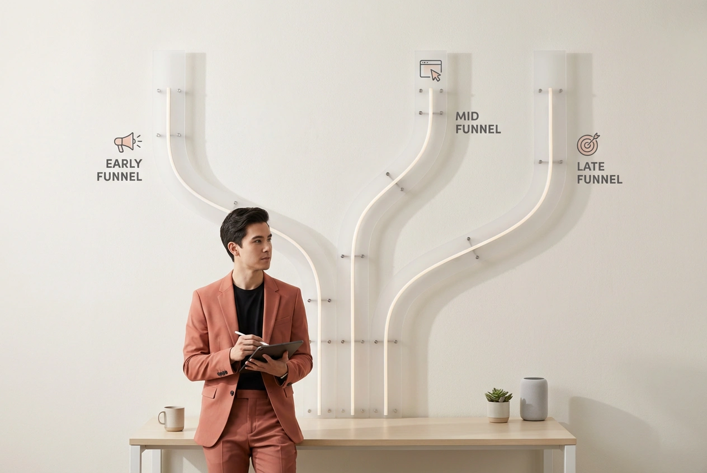

#### A practical funnel diagnosis framework for growth and performance teams

## Why paid traffic does not convert

You’re getting traffic.  
Clicks look fine. CPC is reasonable.

But conversions?  
Barely moving.

At this point most teams do one of two things:
- blame the channel (“Meta is dead”)
- tweak creatives endlessly

Both are usually wrong.

Low conversion is rarely a traffic problem.  
It’s a **funnel problem**.

## The real issue: you are looking at the wrong layer

Paid acquisition is just the entry point.

What actually drives results is everything that happens after the click:
- landing page clarity  
- product friction  
- onboarding steps  
- approval / eligibility logic (especially in fintech)

If you don’t understand where users drop off, optimizing traffic is just expensive guesswork.

Most teams never go deep enough here.  
They optimize what’s visible — and ignore what actually drives conversion.

## Step by step: how to diagnose a broken funnel

This is the simplest way to analyze what’s going wrong.

### Step 1. Map your funnel properly

Not “visits → conversions”.

Break it into real steps:
- Visit  
- CTA click  
- Signup / auth  
- Verification / approval  
- Final action (purchase, upgrade, transaction)

If your funnel has fewer than 4–5 steps, you’re hiding the problem.

### Step 2. Find the biggest drop

Look at conversion rates between each step.

You’re looking for:
- **sharp drops**
- not small inefficiencies

Example:
- Visit → CTA: 3%  
- CTA → Signup: 40%  
- Signup → Approval: 5%

The problem is obvious.  
It’s not ads. It’s approval / qualification.

### Step 3. Identify the type of problem

Every drop belongs to one of three categories:

#### 1. Expectation mismatch

User expected one thing, got another.

Typical signs:
- low CTA click rate  
- high bounce rate

Fix:
- align ad → landing message  
- remove ambiguity

#### 2. UX / friction problem

User wants to continue but something is annoying or unclear.

Typical signs:
- drop during signup  
- abandonment mid-flow

Fix:
- simplify steps  
- reduce required input  
- make next action obvious

#### 3. Product / eligibility constraint

User physically can’t convert.

Very common in fintech.

Typical signs:
- strong early funnel  
- collapse at approval stage

Fix:
- better targeting (pre-scoring, segmentation)  
- set expectations earlier  
- adjust who you acquire

## Common reasons why paid traffic does not convert

If you’re troubleshooting this, the most common causes are:

- mismatch between ad and landing page  
- unclear value proposition  
- too many steps in onboarding  
- strict approval or eligibility criteria  
- low-intent traffic from scaling campaigns  

In most cases, the issue is not traffic quality alone, but how the funnel handles that traffic.

## Why most teams misdiagnose this

Because marketing dashboards lie.

They show:
- CTR  
- CPC  
- CPA

They don’t show:
- *why* conversion fails

So teams optimize what they see:
- creatives  
- bids  
- targeting tweaks

While the real issue sits inside the product funnel.

## A simple rule that saves budgets

If early funnel conversion is weak:  
→ fix messaging and landing

If mid funnel is weak:  
→ fix UX  

If late funnel is weak:  
→ fix targeting or product constraints  

Anything else is noise.

## Example: a simplified fintech funnel

Let’s say you run paid traffic to a fintech product.

You get:
- 100,000 visits  
- 3,000 CTA clicks  
- 1,200 signups  
- 50 approvals  

Most teams:  
→ optimize ads  

Better approach:  
→ realize approval rate is the bottleneck  

Then:
- adjust targeting  
- use pre-scored audiences  
- set clearer expectations  

Result:  
same traffic → significantly more conversions  

### A real pattern you’ll recognize

In many fintech funnels, the distribution looks something like this:

- Visit → CTA: ~2–4%  
- CTA → Signup: ~30–50%  
- Signup → Approval: <10%  

At first glance, it looks like a traffic problem.

In reality, approval logic is often the bottleneck — a large share of users simply isn’t eligible.

Once targeting is aligned with eligibility, and expectations are set earlier in the funnel,  
approval rates tend to increase without scaling traffic.

## Why scaling traffic makes things worse

This is where it gets painful.

When you scale budgets:
- you reach lower-quality users  
- approval rate drops  
- CAC increases  

So performance declines even if campaigns look “fine”.

This is why:

> Growth is often limited by audience quality, not budget.

## What to do next

If your paid traffic isn’t converting:

1. Map your funnel in detail  
2. Find the biggest drop  
3. Identify the problem type  
4. Fix that layer only  

Don’t touch everything at once.

## Final thought

Paid acquisition doesn’t create demand.  
It exposes your funnel.

Most teams try to fix performance at the campaign level.

Very few go deep enough into the funnel itself.  
That’s usually where the biggest gains are hiding.

If you’re working on a similar problem, this is exactly the kind of situation where small structural fixes outperform any campaign tweaks.

If you need help diagnosing a funnel like this, or just want to talk through a paid acquisition problem, email me at [me@mzhirnov.com](mailto:me@mzhirnov.com).