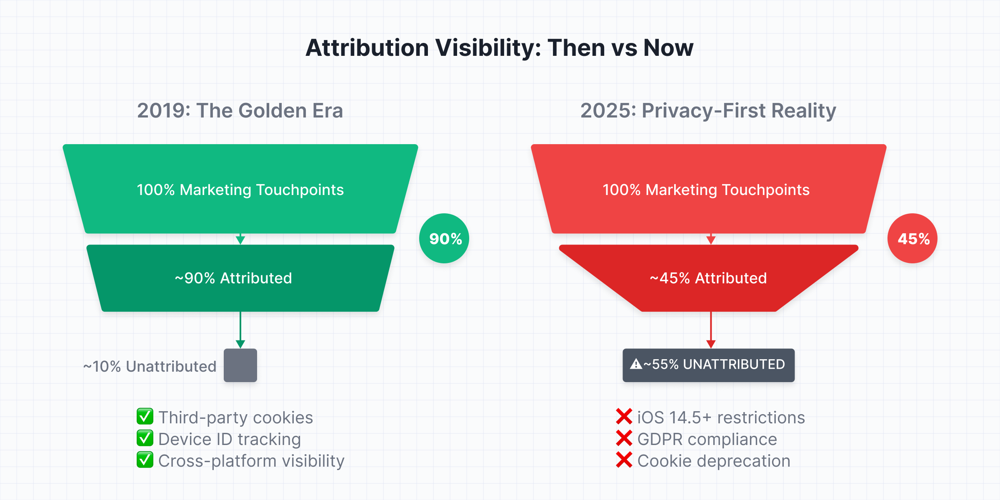
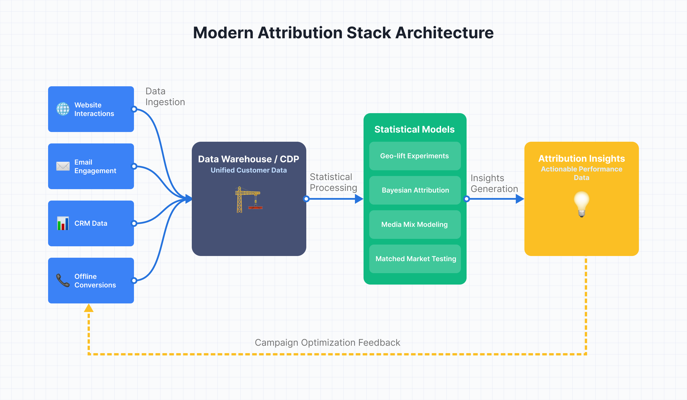
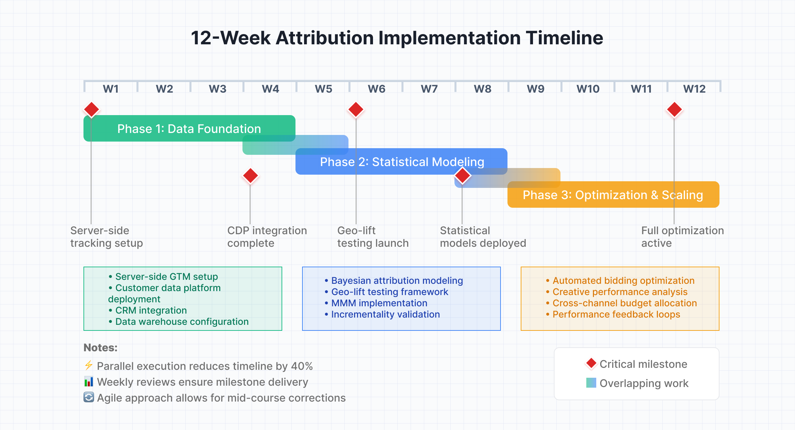
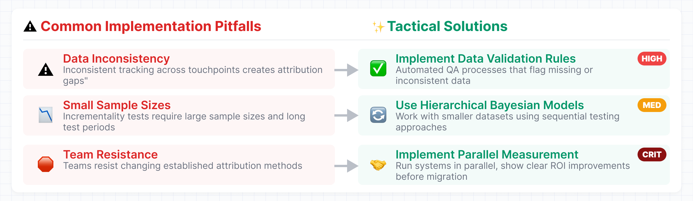
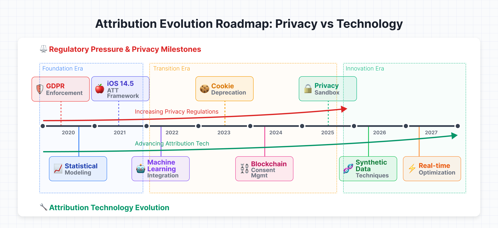

## Introduction: The Attribution Crisis is Real—And Getting Worse
According to recent studies, 73% of marketing leaders report decreased attribution confidence since iOS 14.5, GDPR enforcement, and Google's privacy sandbox have created a measurement black hole where 40-60% of conversions go unattributed to their true sources. For performance marketers managing multi-million dollar budgets, this isn't just an inconvenience—it's an existential threat to proving ROI and making intelligent optimization decisions.

The solution isn't to abandon measurement, but to architect attribution systems designed for privacy-first reality. This means building infrastructure that captures meaningful signals while respecting user privacy, combining first-party data with advanced statistical modeling, and creating feedback loops that actually improve campaign performance.

## The Three Pillars of Modern Privacy-First Attribution
### Pillar 1: Enhanced First-Party Data Collection
The foundation of any robust attribution system in 2025 is comprehensive first-party data capture that doesn't rely on third-party cookies or device IDs.

**Implementation Strategy:**
- **Server-side tracking** infrastructure that captures user interactions directly to your data warehouse
- **Enhanced conversions** setup using hashed email addresses and phone numbers  
- **Custom event tracking** for micro-conversions that indicate purchase intent
- **Cross-device user identification** through authenticated sessions

**Technical Architecture:**

Deploy a Customer Data Platform (CDP) or build custom data pipelines that aggregate touchpoints from:

- **Website interactions** (via server-side GTM or custom tracking)
- **Email engagement data**
- **CRM touchpoints** and sales interactions  
- **Offline conversion data** (phone calls, in-store purchases)
- **Customer service interactions**

{}
**Server-Side Implementation Results: SaaS Case Study:**

For a SaaS client, we implemented server-side tracking that captured 73% more conversion events than the previous cookie-based system. By combining form submissions, demo requests, and trial signups into a unified attribution model, we identified $2.3M in previously "dark" advertising ROI.
{}

### Pillar 2: Statistical Modeling and Incrementality Testing

When direct attribution fails, **statistical inference fills the gap**. Modern attribution systems combine observational data with controlled experiments to estimate true causal impact.

**Core Methodologies:**

- **Geo-lift experiments:** Split test campaigns by geographic regions to measure true incrementality
- **Matched market testing:** Use control/test market pairs with similar demographics and behavior patterns  
- **Bayesian attribution modeling:** Apply probabilistic models that update beliefs as new data arrives
- **Media mix modeling (MMM):** Aggregate-level analysis showing how different channels contribute to overall performance

### Pillar 3: Privacy-Compliant Signal Enhancement

The key is **maximizing signal quality within privacy constraints**, not trying to circumvent privacy protections.

**Tactical Implementation:**

- **Enhanced conversions:** Upload hashed PII (personally identifiable information) to ad platforms for better matching
- **Customer lifetime value signals:** Feed actual revenue and retention data back to ad platforms
- **Lookalike audience creation:** Use first-party customer segments to build targeting models
- **Consent-based tracking optimization:** Maximize measurement for users who opt into tracking

## Building Your Attribution Infrastructure: A Step-by-Step Blueprint

### Phase 1: Data Foundation (Weeks 1-4)

**Goal:** Establish comprehensive, privacy-compliant data collection

**Technical Setup:**
- Implement server-side Google Tag Manager or custom tracking solution
- Deploy customer data platform (Segment, mParticle, or custom-built)
- Set up data warehouse (BigQuery, Snowflake, or Redshift)
- Create unified customer ID system combining email, phone, and authenticated sessions

**Key Integrations:**
- CRM system (Salesforce, HubSpot, etc.)
- Email marketing platform (Klaviyo, Mailchimp, etc.)
- Customer service tools (Zendesk, Intercom, etc.)
- E-commerce platform (Shopify, Magento, etc.)

### Phase 2: Advanced Measurement Implementation (Weeks 5-8)

**Goal:** Deploy statistical models and incrementality testing framework

**Statistical Modeling Setup:**
- Implement Bayesian attribution models using Python/R or specialized tools like Meridian (Google's open-source MMM)
- Set up geo-lift testing infrastructure for key campaigns
- Deploy anomaly detection systems to identify measurement issues
- Create automated reporting dashboards combining multiple attribution methods

{}
**Real-World Case Study: European Expansion**

For a SaaS client, we implemented server-side tracking that captured 73% more conversion events than the previous cookie-based system. By combining form submissions, demo requests, and trial signups into a unified attribution model, we identified $2.3M in previously "dark" advertising ROI.
{}

### Phase 3: Optimization and Scaling (Weeks 9-12)

**Goal:** Create feedback loops that improve campaign performance

**Advanced Features:**
- Automated bidding adjustments based on true incrementality data
- Creative performance analysis using multi-touch attribution
- Customer lifetime value optimization across channels
- Cross-channel budget optimization using portfolio bidding approaches

## Overcoming Common Implementation Challenges

### Challenge 1: Data Quality and Consistency

**Problem:** Inconsistent tracking across touchpoints creates attribution gaps

**Solution:** Implement data validation rules and automated QA processes that flag missing or inconsistent data

### Challenge 2: Statistical Significance

**Problem:** Incrementality tests require large sample sizes and long test periods

**Solution:** Use hierarchical Bayesian models that can work with smaller datasets and sequential testing approaches

### Challenge 3: Organizational Adoption

**Problem:** Teams resist changing established attribution methods

**Solution:** Implement parallel measurement systems during transition period, showing clear ROI improvements before full migration

## Measuring Success: KPIs for Your New Attribution System

**Primary Metrics:**

- **Attribution Coverage:** Percentage of conversions linked to marketing touchpoints (target: >75%)
- **Incrementality Validation:** Correlation between modeled attribution and lift test results (target: >0.8)
- **Decision Velocity:** Time from insight to campaign optimization (target: <48 hours)
- **ROI Accuracy:** Difference between predicted and actual campaign performance (target: <15% variance)

**Advanced Metrics:**

- **Cross-channel synergy coefficient:** How channels amplify each other's performance
- **Customer journey complexity score:** Average touchpoints before conversion
- **Privacy compliance score:** Percentage of measurement respecting user privacy choices

## The Future of Privacy-First Attribution

Looking ahead to 2026-2027, expect further evolution toward:

- **AI-powered attribution modeling** that automatically adjusts for privacy constraints
- **Blockchain-based consent management** enabling privacy-preserving cross-platform measurement
- **Advanced synthetic data techniques** for training models without compromising individual privacy
- **Real-time incrementality optimization** using automated testing frameworks

The companies that invest in **sophisticated attribution infrastructure today** will have insurmountable competitive advantages as privacy regulations tighten and traditional measurement methods become obsolete.

## Conclusion: Attribution as Competitive Advantage

**Privacy-first attribution isn't just about compliance**—it's about building marketing systems that are **more accurate**, **more reliable**, and **more aligned with customer preferences** than anything possible in the cookie-based era. The organizations that master these approaches will not only survive the privacy transition but will emerge with **better measurement**, **better optimization**, and **better results** than ever before.

The question isn't whether to modernize your attribution—it's **whether you'll lead the transformation or be left behind by competitors who do**.
