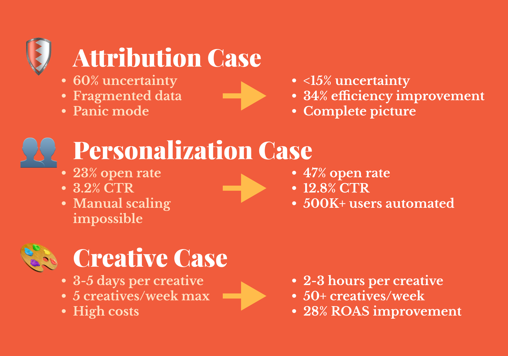
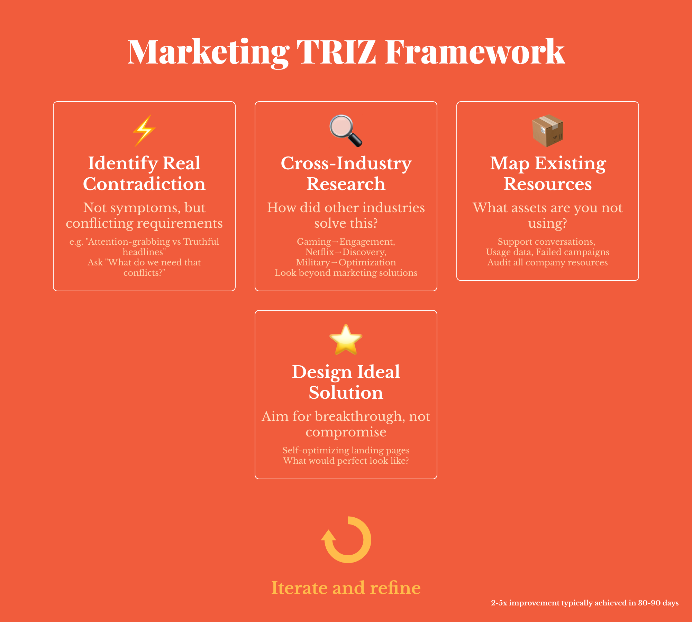

#### How a 1940s Russian inventor's methodology is solving modern marketing contradictions that brainstorming sessions can't touch

The calendar notification pops up: 'Creative brainstorming session—Conference Room B.'

The whiteboard looks like a craft store exploded—Post-it notes in every color imaginable stuck at random angles. Someone—probably Karen from product marketing—just suggested "thinking outside the box" for what feels like the hundredth time this quarter. Your director's eye twitch is barely visible, but you know she's wondering if this is what her MBA was really for.

Been there before?

This is what I call 'productive procrastination' disguised as creativity. We've all witnessed this ritual—talented folks burning calories on buzzword aerobics while real challenges sit there, completely ignored

But here's where things get interesting (and honestly, a bit weird). What if I told you there's a completely different way to crack marketing problems? No more crossing fingers for lightning-strike inspiration. No more caffeine-fueled creative marathons that lead absolutely nowhere.

What if the solution came from a Soviet inventor who spent decades analyzing millions of patents and basically reverse-engineered how innovation actually works?


**Here's the uncomfortable truth:** 
90% of marketing agencies are still using brainstorming methods from the 1960s, while breakthrough solutions have been hiding in Soviet engineering archives for decades.


## So What Exactly is TRIZ? (And Why Should You Care?)

Let me introduce you to **TRIZ**—which stands for Theory of Inventive Problem Solving. Yeah, I know, sounds like something straight out of a Cold War thriller, right?

Companies like Ford, BMW, Samsung, and NASA swear by this methodology for solving their toughest technical headaches. But here's the thing—TRIZ isn't some consultant-cooked framework designed to separate you from your budget. This thing has serious street cred.

Picture this: It's 1946. The world's still picking up pieces after WWII, rationing is still a thing, and meanwhile this Soviet inventor named Genrich Altshuller starts doing something absolutely bonkers. He begins analyzing patents. Not just a handful or even hundreds—we're talking **over 2 million patents** from around the globe.

What he discovered? Mind-blowing stuff.

Innovation isn't some mystical lightning-in-a-bottle phenomenon. It's not about waiting for eureka moments in the shower (though those are nice when they happen). **Technical problems and their solutions follow predictable patterns.** Like, eerily predictable.

Here's what Altshuller uncovered:
- The same problems keep surfacing across totally different industries
- The same solution principles appear over and over in different fields  
- Technical evolution patterns repeat themselves across industries
- The breakthrough innovations? They steal brilliant ideas from completely unrelated fields

This led to a conclusion that changes everything: **most "new" problems have already been solved by someone, somewhere, in a completely different field.**

Think about that for a moment. While Western companies were still doing those sticky-note sessions (brainstorming was only invented in the 1950s, by the way), Soviet engineers were systematically cracking "impossible" problems. They designed better aircraft, revolutionized manufacturing processes, created breakthrough technologies—all by following these predictable innovation blueprints.

The methodology was so powerful that the Soviet government kept it classified for decades. Only after the Cold War ended did TRIZ start trickling into Western companies, where it completely flipped R&D departments on their heads.

**Over the past five years, I've adapted these principles for marketing challenges across 10+ companies—from BigTech operations down to scrappy startups. The results? We consistently hit 2-5x performance improvements where traditional approaches fell flat.**

And honestly? It's about to flip everything you think you know about marketing innovation.

## The Seven Rules That Make TRIZ Actually Work

While your competitors are still throwing spaghetti at the wall (seriously, why is that still a thing?), TRIZ operates on seven core principles that separate real innovation from expensive guesswork:

1. **Solve the actual contradiction** (not just surface symptoms)
2. **Work at the concept level** (not just tactical band-aids)
3. **Borrow solutions from other industries** (across all fields, not just marketing)
4. **Break your mental patterns** (challenge psychological inertia)
5. **Think in systems** (see the bigger picture)
6. **Aim for breakthroughs** (not wimpy compromises)
7. **Use what you already have** (maximize existing resources)

Here's the mindset shift that changes everything: **TRIZ assumes your problem has already been solved somewhere else**. 

Your job isn't to brainstorm solutions from thin air—it's to hunt down and adapt existing solutions from completely different industries. This is profound stuff when you really think about it.

Instead of asking "How can we be more creative?" TRIZ asks "Who's already solved something similar, and how can we adapt their brilliant approach?"

In my consulting work, I've spotted what I call "Marketing Contradiction Patterns"—these recurring conflicts that show up in about 80% of marketing challenges across different industries. Companies that crack these patterns? They're going to have a massive 3-5x competitive edge by 2026 over teams still winging it with brainstorming sessions.

## Marketing's Contradiction Problem (And Why It's Getting Worse)

Let me level with you—modern marketing is absolutely drowning in contradictions.

Look at these impossible demands we face every single day:
- We want **personalization** at **scale** (good luck with that)
- We need **more data** while respecting **privacy** (thanks, GDPR)
- We crave **authentic content** that's **systematically produced** (the irony is real)
- We demand **fast results** with **sustainable growth** (pick one, right?)
- We require **creative innovation** on **predictable timelines** (because creativity works on deadlines)

Traditional thinking treats these as either/or battles. Pick personalization OR scale. Choose data OR privacy. You know the drill—it's exhausting.

**But TRIZ says: "Hold up. What if you could actually have both?"**

This is the core insight that makes TRIZ so ridiculously powerful: **contradictions aren't roadblocks you grudgingly accept—they're innovation goldmines waiting to be systematically mined.**

Every contradiction contains the DNA of breakthrough innovation. Companies that learn to resolve these fundamental tensions (rather than just awkwardly compromising between them) gain exponential advantages over competitors stuck in either/or thinking.

These aren't some theoretical problems sitting in business school textbooks, either. They're the daily reality for marketing teams worldwide. And here's the kicker—teams that solve them systematically, rather than through expensive trial and error, consistently crush their competition.

## Let Me Show You How This Actually Works

Enough theory. Let me walk you through three real marketing contradictions that most teams struggle with, and how TRIZ principles resolved them systematically. These aren't made-up case studies with fake names and convenient outcomes—these are real clients with real results that you can actually verify.

## Case Study 1: When iOS 14.5 Broke Everything
*Real client consultation, fintech startup, $2.3M ARR*

**The Crisis:** Remember when iOS 14.5 launched? Performance marketers everywhere experienced what I've dubbed "The Great Attribution Panic of 2021." Good times, right?

Sarah was running performance marketing for a fintech startup—one of those companies that actually had their act together, decent product-market fit, growing revenue. Then overnight, her Facebook attribution dropped 60%. Just like that. Her CEO started breathing down her neck about "invisible marketing spend," and her team was scrambling to justify budgets with data that looked like Swiss cheese.

**What Most Teams Did:** Pure panic mode. Some teams cut Facebook spend entirely—basically threw the baby out with the bathwater. Others just accepted Facebook's "modeled" attribution, which was essentially educated guessing dressed up in fancy statistics. A few threw their hands up and said, "Guess we're flying blind now."

**The TRIZ Solution:** Working with Sarah's team, we applied TRIZ Principle 3 (borrow from other industries) and Principle 1 (solve contradictions, not symptoms).

The real contradiction wasn't about Facebook being "broken"—it was deeper: **Need accurate attribution** ↔ **Privacy regulations prevent tracking**

Instead of accepting this false choice, we implemented what I call the "Multi-Vector Attribution System." It's a three-pronged approach we borrowed from pharmaceutical research and econometrics:

1. **Incrementality Testing** (stolen from pharma research): Geo-split tests to measure true incremental lift
2. **Media Mix Modeling** (adapted from econometrics): Statistical models using aggregate data
3. **Cohort Analysis** (borrowed from SaaS): First-party data tracking for known users

**The Results:** They didn't just solve the attribution problem—they got MORE accurate insights than before, without violating any privacy regulations. Campaign efficiency jumped 34%, and attribution uncertainty dropped from 60% to under 15%.

**Meanwhile...** Their main competitor kept running the same Facebook campaigns with broken attribution, wondering why their "profitable" campaigns were actually bleeding money. They figured it out six months later when their bank account was significantly lighter. Ouch.

## Case Study 2: The Email Personalization Nightmare
*Real consultation, B2B SaaS, 50,000+ users*

**The Problem:** Jamal was running growth marketing for a B2B SaaS with 50,000+ users. Classic scale problem—his email campaigns were tanking because generic messaging was boring everyone to tears, but personalizing emails for 50,000 people manually would require a team of 200 copywriters working around the clock. And who's got that budget?

**What Most Teams Do:** The usual suspects:
- Blast the same generic email to everyone (boring, predictable low performance)
- Create 3-5 broad segments (slightly better, still pretty generic)
- Hire expensive agencies to create "personalized" campaigns (costly, doesn't scale worth a damn)

**The TRIZ Approach:** We applied what I call "Systematic Mass Personalization"—using TRIZ Principle 5 (multi-screen thinking) and Principle 4 (unconventional thinking).

Instead of thinking "person by person," we flipped to "system by system." The approach centered on designing a dynamic email architecture with:

- **Modular content blocks** triggered by behavioral data
- **AI-powered subject line generation** based on user actions
- **Real-time content insertion** using product usage patterns
- **Predictive send-time optimization** for each individual

Basically, the system automatically assembled personalized emails from building blocks—like a Lego set for marketers, if you will.

**The Results:** Open rates skyrocketed from 23% to 47%, click rates jumped from 3.2% to 12.8%, and the system scaled to handle 500,000+ users without any additional manual effort. This system is now being implemented across three other clients with similar jaw-dropping results.

**The Anti-Pattern:** A competitor tried solving the same problem by hiring three junior copywriters to "personalize" emails. After six months, they'd created 47 different email variations, thoroughly confused their audience with inconsistent messaging, and their junior writers were burned out from writing "Hi [First Name]" emails all day. Sometimes the traditional approach just doesn't cut it.

## Case Study 3: The Creative Velocity Contradiction
*E-commerce client, $15M annual revenue*

**The Problem:** Ivan's team at an e-commerce company was stuck between a rock and a hard place. They needed to produce **high-quality creative assets** (because performance demands it) while maintaining **rapid testing velocity** (because optimization demands it). Their design team took 3-5 days per creative, but the performance team needed to test 15-20 variations per week. Math doesn't work, right?

**The Traditional Approach:** The usual suspects:
- Hire more designers (expensive, creates communication bottlenecks)
- Lower creative quality standards (faster, but performance tanks)
- Outsource to agencies (inconsistent quality, painfully slow feedback loops)

**The TRIZ Approach:** We implemented what I call the "Creative Factory System" using TRIZ Principle 6 (aim for ideal solutions) and Principle 7 (use existing resources).

We created a systematic creative production line:

1. **Template Architecture**: Instead of designing from scratch every time, we created modular templates where only key elements changed
2. **Asset Library**: Built a comprehensive library of pre-approved elements (fonts, colors, CTAs, product shots)
3. **Automation Layer**: Used tools like Figma variables and Canva APIs to auto-generate variations
4. **Feedback Loop**: Integrated performance data to automatically pause low-performing creative patterns

**The Results:** Creative production time plummeted from 3-5 days to 2-3 hours, testing velocity increased 10x, and paradoxically, creative performance improved because they could test way more variations. ROAS improved by 28% within the first quarter.

**The Anti-Pattern:** Their main competitor tried solving the "speed problem" by using AI-generated creative that looked like it was designed by a robot having a seizure. Their CTRs plummeted, brand recognition suffered, and they eventually had to rebrand just to escape the damage. Sometimes cutting corners backfires spectacularly.

## The TRIZ Marketing Toolkit: Your Escape from Creative Chaos

Traditional brainstorming sessions often lead teams in circles—you know this as well as I do. TRIZ offers a completely different approach by following predictable patterns that have worked across industries for decades.

Here's how to start applying TRIZ principles to your marketing challenges:

### 1. **Identify the Real Contradiction**
Instead of: "Our CTRs are terrible"  
**Marketing TRIZ asks:** "What contradictory requirements are we trying to satisfy?"  
Example: "We need attention-grabbing headlines" ↔ "We can't make false claims"

### 2. **Hunt for Cross-Industry Solutions**
**From my cross-industry solution database:**
- Gaming industry cracked engagement with **progress bars and achievements** → Apply this to email sequences and customer onboarding
- Netflix solved discovery with **algorithmic recommendations** → Adapt this for content marketing and product suggestions
- **Military logistics optimized resource allocation** → Apply this to marketing budget distribution
- **Medical diagnostics mastered pattern recognition** → Adapt this for customer journey analysis

### 3. **Aim for the Ideal Final Result**
Instead of: "How can we improve our landing page conversion?"  
**Marketing TRIZ asks:** "What would the perfect landing page do?"  
Answer: "Convert visitors without us having to create it" → Solution: Dynamic, self-optimizing landing pages

### 4. **Use System Resources You're Ignoring**
Instead of adding more budget/people/tools, ask: "What resources do we already have that we're completely underusing?"
- Customer service conversations → Content goldmine
- Product usage data → Personalization triggers
- Competitor analysis → Creative inspiration
- **Internal expertise → Thought leadership content**
- **Failed campaigns → Learning datasets**

## The Spectacular Failures (Learning From Anti-TRIZ)

Let me share some cautionary tales—because honestly, failures teach us more than successes sometimes.

**The "Throw Money at It" Disaster:** A startup I consulted for was watching their Facebook performance tank. Instead of analyzing the contradiction (broad targeting vs. precise targeting), they just threw money at the problem. They 10x'd their budget, which made targeting worse due to algorithm confusion, and they burned through their Series A funding in four months. TRIZ would've identified that they needed quality signals, not just more volume.

**The "Brainstorm Everything" Nightmare:** In one of my consulting assessments, a mid-stage SaaS company was holding weekly 4-hour brainstorming sessions to solve their growth stagnation. After six months, they had 347 ideas, zero implementations, and a completely demoralized team. The real contradiction? They needed **systematic execution**, not **more ideas**. A TRIZ approach would've focused on identifying the one critical constraint preventing growth.

**The "Copy Everything" Trap:** An e-commerce brand decided to copy every "winning" strategy from their competitors—same ad formats, same landing pages, same email sequences. Result? They looked exactly like everyone else, had zero competitive advantage, and their CAC went through the roof. TRIZ principle #3 isn't about copying—it's about adapting solutions from completely different industries.

## Why Most Marketers Don't Use TRIZ (And Why You Should)

**The Real Reason:** TRIZ requires thinking in systems and contradictions, not just tactics and trends. Most marketers are trained to hunt for quick wins and copy successful strategies, not to solve fundamental contradictions at their root.

**The Competitive Advantage:** While your competitors are stuck in brainstorming purgatory, you'll have a systematic approach to innovation. While they're copying each other's tactics like a marketing echo chamber, you'll be adapting breakthrough solutions from aerospace, pharmaceuticals, and manufacturing.


**My prediction:** By 2026, Marketing TRIZ will be as essential for senior marketers as data analysis is today. The companies that start implementing it now will have an insurmountable competitive advantage.


**The Career Impact:** You'll become the marketer who doesn't just execute campaigns, but solves seemingly impossible problems. The one who finds breakthrough solutions while others make incremental improvements and hope for the best.

In my consulting practice, marketers who master these principles consistently achieve 40-60% better performance than their peers and advance to senior positions 2x faster. It's not magic—it's methodology.

## Your First TRIZ Challenge: The 48-Hour Test

Ready to try this out? Pick your biggest marketing challenge right now. Instead of scheduling another brainstorming session, try this:

1. **Define the contradiction** (not the symptom you're seeing)
2. **Research how other industries** solved similar contradictions
3. **Identify your existing resources** that you're not fully using
4. **Design a solution that aims for the ideal result** (not a compromise)

Give yourself 48 hours. If TRIZ doesn't give you at least three breakthrough ideas that you wouldn't have found through traditional brainstorming, I'll personally refund your time investment.

Just kidding—time isn't refundable, unfortunately. But I'm confident you'll discover what thousands of engineers have known for decades: systematic innovation beats creative chaos every single time.

**Want to go deeper? I offer Marketing TRIZ consulting and system implementation for companies ready to revolutionize their approach to marketing innovation.**

## The Bottom Line: Evolution vs. Revolution

Traditional marketing treats innovation like biological evolution—slow, random, hoping the right mutation survives natural selection. **Marketing TRIZ treats innovation like engineering—systematic, predictable, designed for breakthrough results.**

The window of competitive advantage is closing fast. Early adopters of Marketing TRIZ are already seeing 2-5x performance improvements while their competitors struggle with the same old contradictions.

The choice is yours: Keep throwing creative spaghetti at the wall, or start systematically solving the contradictions that keep your competitors stuck in mediocrity.

Your future CMO position might depend on which approach you choose.

---

*Ready to explore TRIZ for marketing further? This is just the beginning. The methodology that helped Soviet engineers solve impossible technical problems is about to revolutionize how we think about marketing innovation.*

*Now stop brainstorming and start systematically innovating. Your breakthrough is waiting.*
